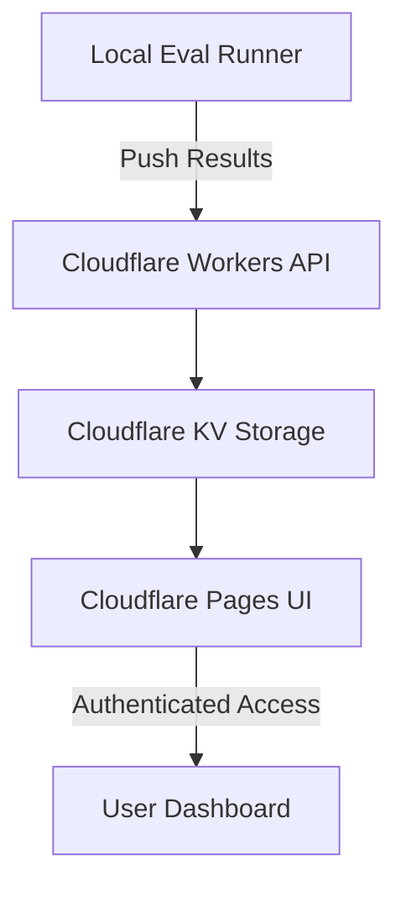

# LLM Evaluation Suite

A portfolio-grade evaluation suite for testing and comparing LLM capabilities across enterprise-relevant scenarios.

## Overview

This evaluation suite tests models across 8 planned capability dimensions:

### ✅ Complete (4/8)
1. **BC Tax Spreadsheet** - Financial modeling with formula generation
2. **Structured Output Validation** - JSON/XML/CSV generation compliance  
3. **Closed-Book Knowledge Recall** - Factual accuracy without external sources
4. **Prompt Injection Resistance** - Security and adversarial robustness

### 🚧 In Progress (0/2 - Tier 2)
5. **Long-Context Coherence** - Multi-turn conversation with evolving constraints
6. **MCP Tool Selection** - Agent tool calling at scale (200+ tools)

### 🔮 Planned (0/2 - Tier 3+)
7. **ZDL Synthesis** - Zapier automation configuration generation
8. **Guardrails Pipeline A/B** - Safety architecture evaluation

**Current Status:** Tier 1 complete, Tier 2 50% complete (2/4 evals done)  
**Active Branch:** `feat/tier2-core-evals`  
**See:** `handoffs/2025-01-09-tier2-continuation.md` for detailed status

## Architecture



- **Framework**: Custom YAML-based eval runner (Python)
- **Providers**: OpenAI ✅, Anthropic ✅, Google Gemini 🚧
- **Storage**: Cloudflare KV (planned for Tier 3)
- **UI**: Static React SPA on Cloudflare Pages (planned for Tier 3)
- **Cost**: $0/month hosting + LLM API usage only

## Quick Start

### Setup

```bash
# Clone the repository
git clone https://github.com/austinbjohnson/evaluation-suite.git
cd evaluation-suite

# Create virtual environment
python -m venv venv
source venv/bin/activate  # On Windows: venv\Scripts\activate

# Install dependencies
pip install -r requirements.txt

# Configure API keys
cp .env.example .env
# Edit .env and add your API keys
```

### Running Evaluations

```bash
# List available evals
python -m runner.cli list

# Run a specific eval
python -m runner.cli run evals/bc_tax_spreadsheet

# Run with specific models
python -m runner.cli run evals/bc_tax_spreadsheet --models gpt-4,claude-3.5-sonnet

# Generate HTML report
python -m runner.cli report <run-id>

# Quick automated test (runs both Tier 1 evals)
./test_tier1.sh
```

📖 **See [docs/TESTING_GUIDE.md](docs/TESTING_GUIDE.md) for detailed step-by-step testing instructions.**

## Project Structure

```
evaluation-suite/
├── evals/                      # Evaluation definitions
│   ├── bc_tax_spreadsheet/    # Individual eval directories
│   │   ├── spec.yaml          # Eval configuration
│   │   ├── fixtures/          # Test data
│   │   ├── params/            # Versioned parameters (e.g., 2025.json)
│   │   └── scorer.py          # Grading logic
│   └── ...
├── runner/                     # Eval harness
│   ├── core.py                # Main runner logic
│   ├── providers/             # LLM provider adapters
│   └── scorers/               # Shared scoring utilities
├── infra/                     # Infrastructure as code
│   └── cloudflare/           # Cloudflare Workers & KV
├── ui/                        # Dashboard (React)
├── tests/                     # Test suite
└── requirements.txt
```

## Development

### Adding a New Eval

1. Create eval directory: `mkdir -p evals/my_eval/{fixtures,params}`
2. Define spec.yaml with task definition
3. Add test fixtures
4. Implement scorer.py
5. Run: `python -m runner.cli run evals/my_eval`

### Running Tests

```bash
pytest tests/
```

### Code Quality

```bash
# Format code
black .

# Lint
ruff check .

# Type check
mypy runner/
```

## Cost Tracking

Every eval run automatically tracks:
- Input/output token counts
- Estimated API costs per model
- Latency per test case
- Total cost for full suite

View costs in the generated HTML reports or dashboard.

## Success Metrics

### Technical
- ✅ Full eval suite runs in <5 minutes on 3 models
- ✅ Results reproducible within 2% across seeds
- ✅ Zero secrets committed to repo
- ✅ All eval scores have documented, testable grading logic

### Portfolio
- ✅ README architecture diagram renders in GitHub
- ✅ Live dashboard shows 3+ model comparison with trend charts
- ✅ Each eval has clear enterprise rationale
- ✅ At least one eval shows 15%+ difference between models

## Security

### Reporting Vulnerabilities

If you discover a security vulnerability, please review our [Security Policy](SECURITY.md) for responsible disclosure guidelines.

### Best Practices

1. **Never commit secrets:** All API keys must be in `.env` files (gitignored)
2. **Use `.env.example`:** Template with placeholder values for required variables
3. **Rotate exposed keys:** If you accidentally commit a key, rotate it immediately
4. **Run security audits:** Use `pip-audit` to check for vulnerable dependencies

```bash
# Check for vulnerable dependencies
pip install pip-audit
pip-audit --requirement requirements.txt
```

### Security Features

- ✅ All secrets via environment variables
- ✅ `.gitignore` configured for sensitive files
- ✅ Input validation on model names and file paths
- ✅ Safe error handling (no secret leakage)
- ✅ Dependency vulnerability monitoring
- ✅ No PII in fixtures or test data

For more information, see [SECURITY.md](SECURITY.md).

## License

MIT

## Author

Austin Johnson - [GitHub](https://github.com/austinbjohnson)

